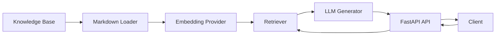
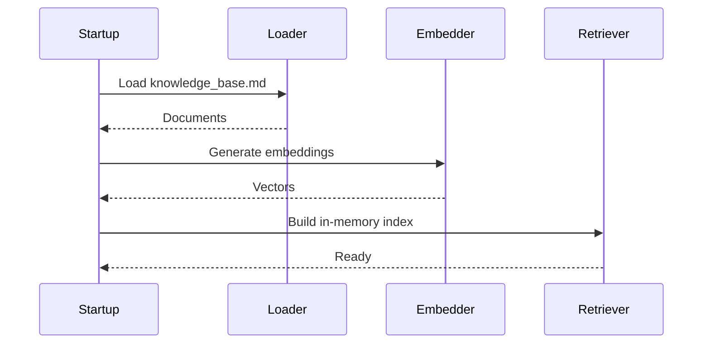
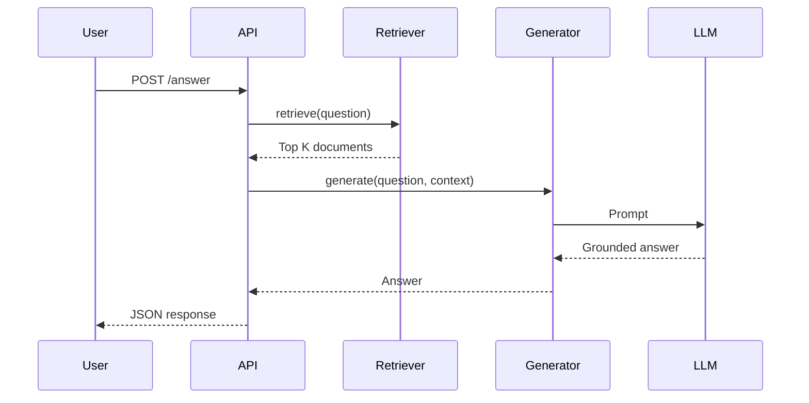

# NimbusCloud Support Assistant

## Overview

NimbusCloud Support Assistant is a Retrieval-Augmented Generation (RAG) API that answers customer support questions using a provided Markdown knowledge base.

The solution emphasizes:

- Grounded responses
- Simple architecture
- Clear separation of concerns
- Testability
- Security
- Extensibility

The application intentionally avoids heavyweight frameworks (LangChain, LlamaIndex, vector databases) because the supplied knowledge base is small and an in-memory retrieval strategy is sufficient.

---

# Features

- FastAPI REST API
- OpenAI-compatible providers (OpenAI or Ollama)
- Markdown knowledge base ingestion
- Semantic retrieval using embeddings
- In-memory vector search
- Grounded answer generation
- Source attribution
- Docker support
- Unit tests
- Dependency injection
- Provider abstraction

---

# Architecture



The application is divided into five layers:

```
API
│
Services
│
Retrieval / Generation
│
Domain
│
Infrastructure
```

Responsibilities

| Layer | Responsibility |
|---------|---------------|
| API | HTTP endpoints |
| Services | Business orchestration |
| Retrieval | Semantic search |
| Generation | LLM interaction |
| Domain | Contracts and models |
| Infrastructure | Providers and configuration |

---

# Indexing Flow

During application startup the knowledge base is indexed.



---

# Query Flow



---

# Retrieval Pipeline

```text
Question
    │
    ▼
Embedding
    │
    ▼
Cosine Similarity
    │
    ▼
Top-K Selection
    │
    ▼
Relevance Threshold
    │
    ▼
Grounded Prompt
    │
    ▼
LLM
```

---

# Project Structure

```
app/
│
├── api/
├── core/
├── domain/
├── generation/
├── ingestion/
├── retrieval/
├── services/
│
tests/
```

---

# Design Decisions

## Why Markdown?

The exercise provides the knowledge base as Markdown.

A loader converts each snippet into a retrieval unit automatically.

No manual document maintenance is required.

---

## Why an In-Memory Retriever?

The supplied knowledge base contains only a few snippets.

An in-memory cosine similarity implementation provides:

- simplicity
- deterministic behaviour
- no external dependencies
- fast startup

The retriever can later be replaced by:

- pgvector
- Azure AI Search
- OpenSearch
- Pinecone

without changing the service layer.

---

## Why Protocols?

The project uses dependency inversion through Protocol interfaces.

```
Retriever
Embedder
AnswerGenerator
```

Concrete implementations are injected at startup.

This allows replacing providers transparently.

---

## Why Ollama Support?

The architecture supports OpenAI-compatible APIs.

This enables:

- OpenAI
- Ollama
- Azure OpenAI
- LocalAI

without changing business logic.

---

# Security

The implementation follows several secure engineering practices.

## Prompt Injection

Retrieved documents are treated as data rather than executable instructions.

The system prompt explicitly instructs the LLM to ignore instructions contained in retrieved documents.

## Secrets

Secrets are loaded from environment variables.

No credentials are committed.

## Grounding

The assistant only answers using retrieved context.

If insufficient evidence exists, a fallback response is returned.

## Deterministic Sources

Source references originate from the retriever rather than the language model.

---

# Configuration

Example:

```bash
AI_PROVIDER=ollama

OLLAMA_BASE_URL=http://localhost:11434/v1

LLM_MODEL=qwen3:4b

EMBEDDING_MODEL=embeddinggemma
```

Switching to OpenAI only requires changing configuration.

---

# Running

Install dependencies

```bash
pip install -r requirements.txt
```

Start the API

```bash
uvicorn app.main:app --reload
```

Swagger

```
http://localhost:8000/docs
```

---

# Docker

Build

```bash
docker build -t nimbus-support-assistant .
```

Run

```bash
docker run \
-p 8000:8000 \
--env-file .env \
nimbus-support-assistant
```

---

# Testing

Run all tests

```bash
pytest
```

Coverage

```bash
pytest --cov=app
```

---

# Future Improvements

Possible production enhancements include:

- Vector database
- Hybrid retrieval
- Metadata filtering
- Reranking
- Conversation memory
- Streaming responses
- Observability
- Metrics
- Authentication
- Rate limiting
- Knowledge base versioning

---

# AI Usage Disclosure

Artificial Intelligence tools were used during the development of this project to improve productivity while maintaining full engineering ownership.

AI assistance included:

- Project architecture brainstorming
- Code reviews and refactoring suggestions
- Documentation generation
- Unit test generation
- Docker configuration
- Design discussions
- Mermaid diagram generation
- Prompt engineering recommendations

All generated code was manually reviewed, validated, adapted, and tested before being incorporated into the solution. Architectural decisions, implementation choices, debugging, and final verification remain the responsibility of the author.

---

# License

This project is provided solely for  technical assessment.