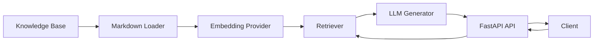
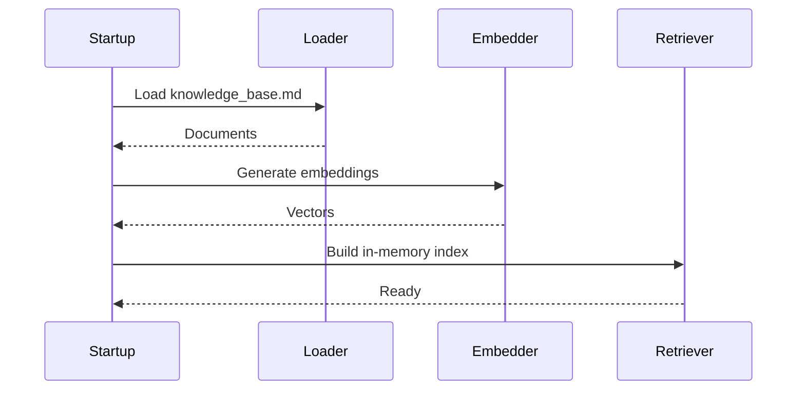
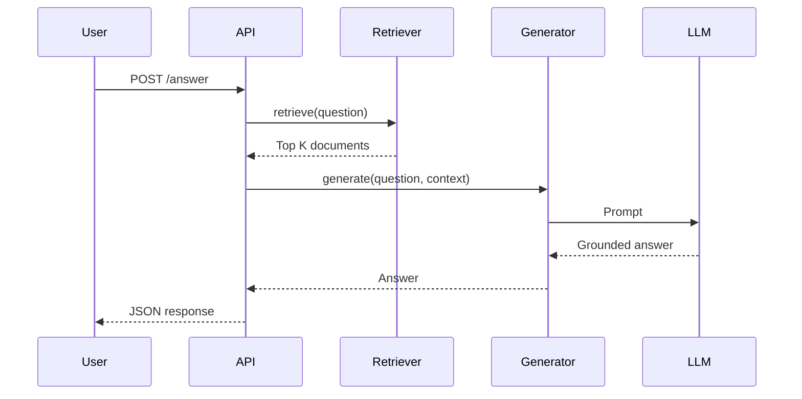

# NimbusCloud Support Assistant

## Overview

NimbusCloud Support Assistant is a Retrieval-Augmented Generation (RAG) API that answers customer support questions using a provided Markdown knowledge base.

The solution emphasizes:

- Grounded responses
- Simple architecture
- Clear separation of concerns
- Testability
- Security
- Extensibility

The application intentionally avoids heavyweight frameworks (LangChain, LlamaIndex, vector databases) because the supplied knowledge base is small and an in-memory retrieval strategy is sufficient.

---

# Features

- FastAPI REST API
- OpenAI-compatible providers (OpenAI or Ollama)
- Markdown knowledge base ingestion
- Semantic retrieval using embeddings
- In-memory vector search
- Grounded answer generation
- Source attribution
- Docker support
- Unit tests
- Dependency injection
- Provider abstraction

---

# Architecture



The application is divided into five layers:

```
API
│
Services
│
Retrieval / Generation
│
Domain
│
Infrastructure
```

Responsibilities

| Layer | Responsibility |
|---------|---------------|
| API | HTTP endpoints |
| Services | Business orchestration |
| Retrieval | Semantic search |
| Generation | LLM interaction |
| Domain | Contracts and models |
| Infrastructure | Providers and configuration |

---

# Indexing Flow

During application startup the knowledge base is indexed.



---

# Query Flow



---

# Retrieval Pipeline

```text
Question
    │
    ▼
Embedding
    │
    ▼
Cosine Similarity
    │
    ▼
Top-K Selection
    │
    ▼
Relevance Threshold
    │
    ▼
Grounded Prompt
    │
    ▼
LLM
```

---

# Project Structure

```
app/
│
├── api/
├── core/
├── domain/
├── generation/
├── ingestion/
├── retrieval/
├── services/
│
tests/
```

---

# Design Decisions

## Why Markdown?

The exercise provides the knowledge base as Markdown.

A loader converts each snippet into a retrieval unit automatically.

No manual document maintenance is required.

---

## Why an In-Memory Retriever?

The supplied knowledge base contains only a few snippets.

An in-memory cosine similarity implementation provides:

- simplicity
- deterministic behaviour
- no external dependencies
- fast startup

The retriever can later be replaced by:

- pgvector
- Azure AI Search
- OpenSearch
- Pinecone

without changing the service layer.

---

## Why Protocols?

The project uses dependency inversion through Protocol interfaces.

```
Retriever
Embedder
AnswerGenerator
```

Concrete implementations are injected at startup.

This allows replacing providers transparently.

---

## Why Ollama Support?

The architecture supports OpenAI-compatible APIs.

This enables:

- OpenAI
- Ollama
- Azure OpenAI
- LocalAI

without changing business logic.

---

# Security

The implementation follows several secure engineering practices.

## Prompt Injection

Retrieved documents are treated as data rather than executable instructions.

The system prompt explicitly instructs the LLM to ignore instructions contained in retrieved documents.

## Secrets

Secrets are loaded from environment variables.

No credentials are committed.

## API Access Security

The application uses a shared API key to protect access to the
RAG endpoints.

The following endpoints require authentication:

- `POST /api/v1/answer`
- `GET /api/v1/config`

The health endpoint, `GET /api/v1/health`, remains public so
Docker and deployment platforms can check whether the service is
available.

### Request Flow

```text
Browser or API client
        │
        │  X-API-Key: <secret>
        ▼
FastAPI security dependency
        │
        ├── Missing or incorrect key → 401 Unauthorized
        ├── Server has no configured key → 503 Unavailable
        └── Correct key → endpoint executes
```

Generate a strong access key:

```bash
openssl rand -hex 32
```

Store it in the local `.env` file:

```env
API_ACCESS_KEY=generated-secret-value
```

Docker Compose injects the value into the application container.
Its required-variable syntax prevents the stack from starting
when `API_ACCESS_KEY` is missing.

Clients provide the key in the `X-API-Key` HTTP header:

```bash
curl \
  -H "X-API-Key: generated-secret-value" \
  http://localhost:8000/api/v1/config
```

FastAPI runs the authentication dependency before the protected
endpoint. The supplied key is compared with the configured
`SecretStr` value using `hmac.compare_digest`, which provides a
timing-safe comparison.

The UI contains an API-key field in the RAG inspector. The key is
held only in the current page's JavaScript memory and is attached
to protected requests. It is not written to cookies,
`localStorage`, or `sessionStorage`, and refreshing the page
clears it.

API keys, questions, prompts, and generated answers are excluded
from structured logs. Responses include an `X-Request-ID` header
that can be matched with server logs without exposing request
credentials or content.

This shared-key approach is intended for internal tools and
trusted clients. It does not provide individual identities,
roles, per-user auditing, or delegated access. A public
multi-user deployment should use OAuth 2.0 or OpenID Connect
instead.

## Grounding

The assistant only answers using retrieved context.

If insufficient evidence exists, a fallback response is returned.

## Deterministic Sources

Source references originate from the retriever rather than the language model.

---

# Configuration

Example:

```bash
AI_PROVIDER=ollama

OLLAMA_BASE_URL=http://localhost:11434/v1

LLM_MODEL=qwen3:4b

EMBEDDING_MODEL=embeddinggemma
```

Switching to OpenAI only requires changing configuration.

---

# Running

Install dependencies

```bash
pip install -r requirements.txt
```

Start the API

```bash
uvicorn app.main:app --reload
```

Swagger

```
http://localhost:8000/docs
```

---

# Docker

The complete stack includes the application, Ollama, and a
one-time bootstrap service that downloads both required models.

```bash
docker compose up --build
```

The first startup takes longer while the models are downloaded.
Subsequent starts reuse the `ollama-data` volume. Open the UI at
<http://localhost:8000> once the `app` service is healthy.

Build only the lightweight UI image without pulling or starting
Ollama:

```bash
docker compose build ui
```

Run only the UI for visual development. API-backed actions show
the disconnected state until the rest of the stack is running:

```bash
docker compose up --no-deps ui
```

Rebuild and replace only a running UI:

```bash
docker compose up --build --no-deps -d ui
```

Follow structured application logs:

```bash
docker compose logs -f app
```

Check service health:

```bash
docker compose ps
```

To customize the port, models, or RAG parameters, copy the
example environment file before starting:

```bash
cp .env.example .env
```

Generate a private API access key and place it in `.env` as
`API_ACCESS_KEY`. Compose refuses to start when this value is
missing:

```bash
openssl rand -hex 32
```

The `/api/v1/answer` and `/api/v1/config` endpoints require the
key in the `X-API-Key` header. The health endpoint remains public
for container probes:

```bash
curl \
  -H "X-API-Key: $API_ACCESS_KEY" \
  http://localhost:8000/api/v1/config
```

The UI accepts the key in its RAG inspector and keeps it only in
the current page's memory. It is cleared on refresh and is never
written to browser storage.

Stop the stack while preserving downloaded models:

```bash
docker compose down
```

Remove the stack and its model volume:

```bash
docker compose down --volumes
```

---

# Testing

Run all tests

```bash
pytest
```

Coverage

```bash
pytest --cov=app
```

---

# Future Improvements

Possible production enhancements include:

- Vector database
- Hybrid retrieval
- Metadata filtering
- Reranking
- Conversation memory
- Streaming responses
- Observability
- Metrics
- Authentication
- Rate limiting
- Knowledge base versioning

---

# AI Usage Disclosure

Artificial Intelligence tools were used during the development of this project to improve productivity while maintaining full engineering ownership.

AI assistance included:

- Project architecture brainstorming
- Code reviews and refactoring suggestions
- Documentation generation
- Unit test generation
- Docker configuration
- Design discussions
- Mermaid diagram generation
- Prompt engineering recommendations

All generated code was manually reviewed, validated, adapted, and tested before being incorporated into the solution. Architectural decisions, implementation choices, debugging, and final verification remain the responsibility of the author.

---

# License

This project is provided solely for  technical assessment.
